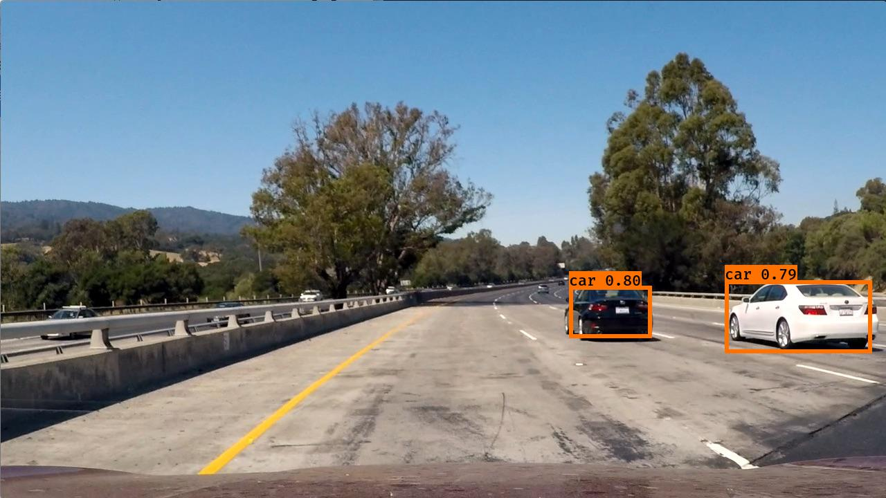

# Vehicle Detection Project using YoLo

This repository is about the last project in CarND-term1.

## 1.Requirements

- [Keras](https://github.com/fchollet/keras)
- [Tensorflow](https://www.tensorflow.org/)
- [Numpy](http://www.numpy.org/)
- [h5py](http://www.h5py.org/) (For Keras model serialization.)
- [Pillow](https://pillow.readthedocs.io/) (For rendering test results.)
- [Python 3](https://www.python.org/)
- [pydot-ng](https://github.com/pydot/pydot-ng) (Optional for plotting model.)

## 2.Installation
- Go to [Carnd-term1-Start-Kit](https://github.com/udacity/CarND-Term1-Starter-Kit) for more detail.

- Get the model weight and convert it to keras model:
```python
wget http://pjreddie.com/media/files/yolo.weights
wget https://raw.githubusercontent.com/pjreddie/darknet/master/cfg/yolo.cfg
./yad2k.py yolo.cfg yolo.weights model_data/yolo.h5
```

## 3.Overview
I use yolo_v2 algorithm which is from this [paper](https://arxiv.org/pdf/1612.08242.pdf) to detecte the vehical. And I achieve a petty good result. The bounding boxes can always catch the car and I run almost **20FPS** using gtx1071. It is amazing.

## 4.YoLo
YOLO ("you only look once") is a popular algoritm because it achieves high accuracy while also being able to run in real-time. This algorithm "only looks once" at the image in the sense that it requires only one forward propagation pass through the network to make predictions. After non-max suppression, it then outputs recognized objects together with the bounding boxes.

#### 4.1 Model detail
Compare to the yolo, yolo_v2 do more staff to imporeve its accuracy and see more classifier:
- `BatchNormalize` to train the classifier and  gain 2% improvement in mAP.
- `High Resolution Classifier` and improve almost 4% mAP.
- `Convolutional With Anchor Boxes` can detect more object in one grid cell


#### 4.2 How to label?

Here's an example of what the bounding boxes look like:


If I have 80 classes that I want YOLO to recognize, I can represent the class label $c$ either as an integer from 1 to 80, or as an 80-dimensional vector (with 80 numbers) one component of which is 1 and the rest of which are 0. 

#### 4.3 Model detail
- The **input** is a batch of images of shape (m, 608, 608, 3)
- The **output** is a list of bounding boxes along with the recognized classes. Each bounding box is represented by 6 numbers $$$(p_c, b_x, b_y, b_h, b_w, c)$$$ as explained above. If I expand $$$c$$$ into an 80-dimensional vector, each bounding box is then represented by 85 numbers. 


We will use 5 anchor boxes. So I can think of the YOLO architecture as the following: IMAGE (m, 608, 608, 3) -> DEEP CNN -> ENCODING (m, 19, 19, 5, 85).
 
Lets look in greater detail at what this encoding represents. 


Since I using 5 anchor boxes, each of the 19 x19 cells thus encodes information about 5 boxes. Anchor boxes are defined only by their width and height.

For simplicity, I will flatten the last two last dimensions of the shape (19, 19, 5, 85) encoding. So the output of the Deep CNN is (19, 19, 425).


Now, for each box (of each cell) I will compute the following elementwise product and extract a probability that the box contains a certain class.


And I use `score_threshold > 0.5` to throw the low probability bounding box out and keep the hign probability bounding box. you can check that in function `yolo_eval` in `pipeline.ipynb` . 

#### 4.4 Non-max suppression
Even after filtering by thresholding over the classes scores, I still end up a lot of overlapping boxes. A second filter for selecting the right boxes is called non-maximum suppression (NMS). 


After I set this `iou_threshold=.5`. I get this result：



## test images


Small car can not be detected. Dammit. 

## video

You can check the video in this [youtube](https://youtu.be/1-0N1A2UG7M) link. Or download it.


## 5.References
**References**: The ideas presented in this notebook came primarily from the two YOLO papers. The implementation here also took significant inspiration and used many components from Allan Zelener's github repository. The pretrained weights used in this exercise came from the official YOLO website. Also, some codes are borrowed from [Andrew ng deep learning ai coursera](https://www.coursera.org/learn/convolutional-neural-networks/notebook/bbBOL/car-detection-with-yolov2)
- Joseph Redmon, Santosh Divvala, Ross Girshick, Ali Farhadi - [You Only Look Once: Unified, Real-Time Object Detection](https://arxiv.org/abs/1506.02640) (2015)
- Joseph Redmon, Ali Farhadi - [YOLO9000: Better, Faster, Stronger](https://arxiv.org/abs/1612.08242) (2016)
- Allan Zelener - [YAD2K: Yet Another Darknet 2 Keras](https://github.com/allanzelener/YAD2K)
- The official YOLO website (https://pjreddie.com/darknet/yolo/) 
